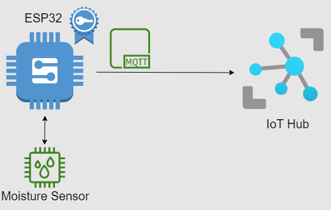

# ESP32 to Azure IoT Hub

## About
This repository holds the code for the ESP32 to connect and send telemetry messages over MQTT to an Azure IoT Hub.

To make this a bit easier I am using the [Azure IoT SDK for C Arduino](https://github.com/Azure/azure-sdk-for-c-arduino) and the example sketch for ESP32 to IoT Hub. 

You also need a [capacitive soil moisture sensor](https://www.amazon.com/Gikfun-Capacitive-Corrosion-Resistant-Detection/dp/B07H3P1NRM) to actually take the readings.

## Get Started
To get started just hook up the sensor to the ESP32 using Analog 0 as your reading pin on the ESP32. 
Clone the repository and add your IoT Hub credentials in the "iot_configs.h" file and flash the sketch to your ESP32.

The sketch contains two different methods for authenticating your ESP32 against the IoT Hub, SAS token and certificate. By default the sketch uses the SAS token but you can easily change the code to use a certificate instead.
If you decide to use a certificate then (if possible) don´t store it in the code in the "iot_configs.h" file as the sketch asks you to. Find a safer solution!

If you want to tweak the telemetry message then check the "getTelemetryPayload" and "sendTelemetry" functions. In "getTelemetryPayload" you can change how the body of the telemetry message will look like and in "sendTelemetry" you can add even more properties to your message. The ones I have added (Encoding: UTF8, Type: application/json) are for readability when the message is stored in Cosmos DB.

To actually route the messages to your instance of Cosmos DB just add a new route with your database as an endpoint in your IoT Hub. 
Microsoft documentation can be found [here.](https://learn.microsoft.com/en-us/azure/iot-hub/iot-hub-devguide-messages-d2c)

Now you should be posting regular telemetry messages to your IoT Hub and routing them to your database.